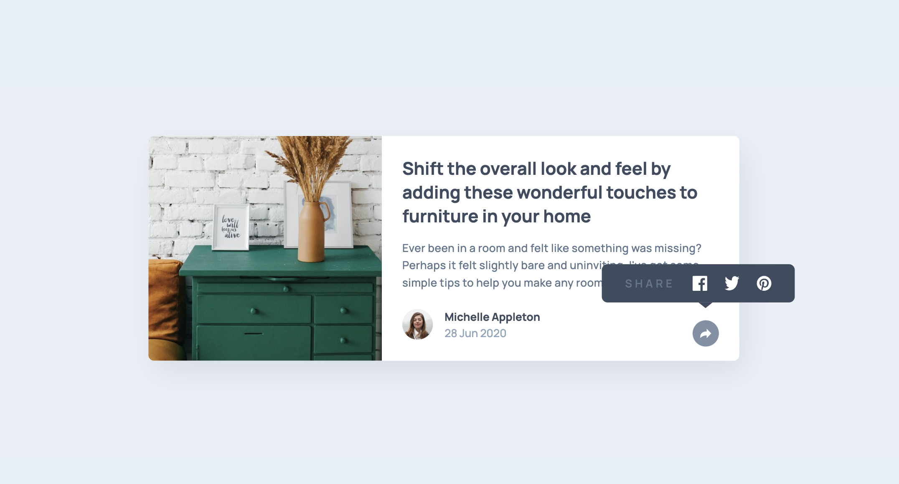
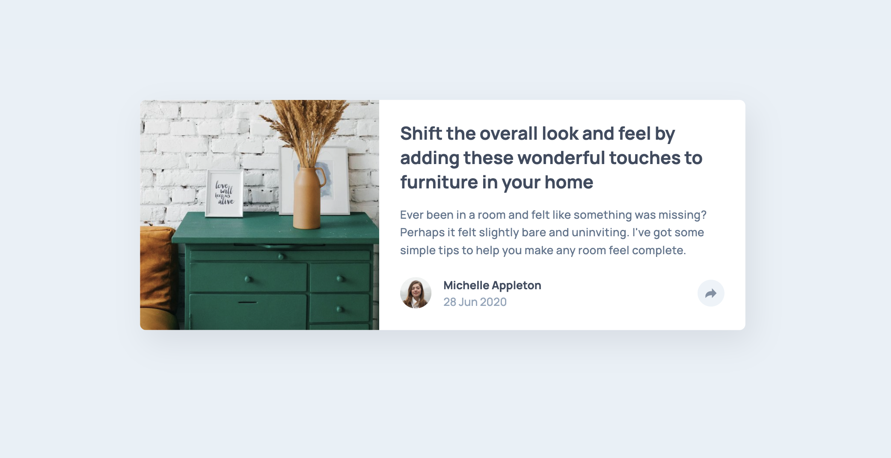
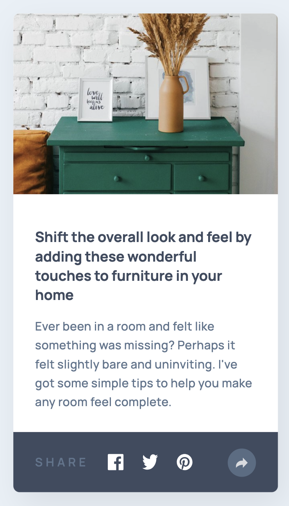
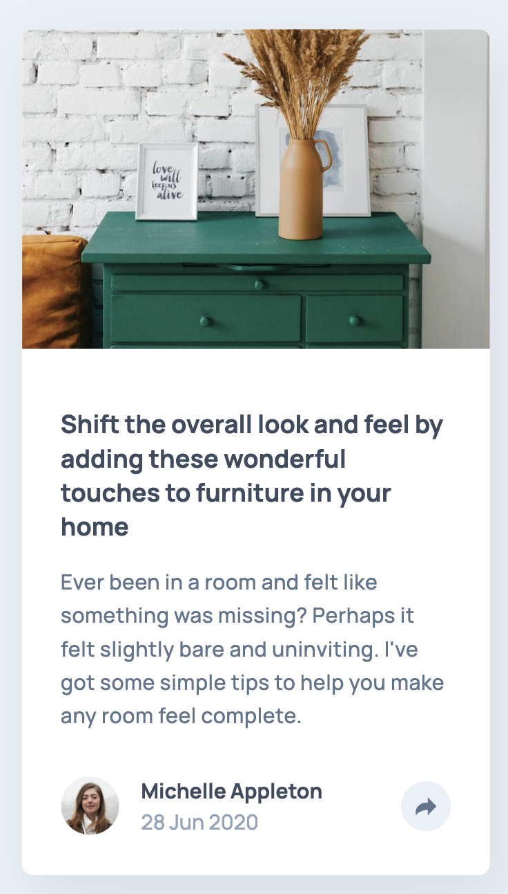

# Frontend Mentor - Article preview component solution

This is a solution to the [Article preview component challenge on Frontend Mentor](https://www.frontendmentor.io/challenges/article-preview-component-dYBN_pYFT). Frontend Mentor challenges help you improve your coding skills by building realistic projects.

## Table of contents

- [Overview](#overview)
  - [The challenge](#the-challenge)
  - [Screenshot](#screenshot)
  - [Links](#links)
- [My process](#my-process)
  - [Built with](#built-with)
  - [What I learned](#what-i-learned)

## Overview

### The challenge

Users should be able to:

- View the optimal layout for the component depending on their device's screen size
- See the social media share links when they click the share icon

### Screenshot

### Links

- Solution URL: [https://github.com/nerdynischal/article-preview-component-master](https://github.com/nerdynischal/article-preview-component-master)
- Live Site URL: [https://nerdynischal.github.io/article-preview-component-master/](https://nerdynischal.github.io/article-preview-component-master/)

## My process

### Built with

- Semantic HTML5 markup
- CSS custom properties
- Flexbox
- Sass/SCSS
- Mobile-first workflow
- JavaScript

### What I learned

Mostly practiced a bit of JavaScript, particularly DOM manipulation. The most challenging part was getting the share button to behave a bit differently on mocile and desktop, which I eventually got there with mostly controling breakpoints in CSS.
